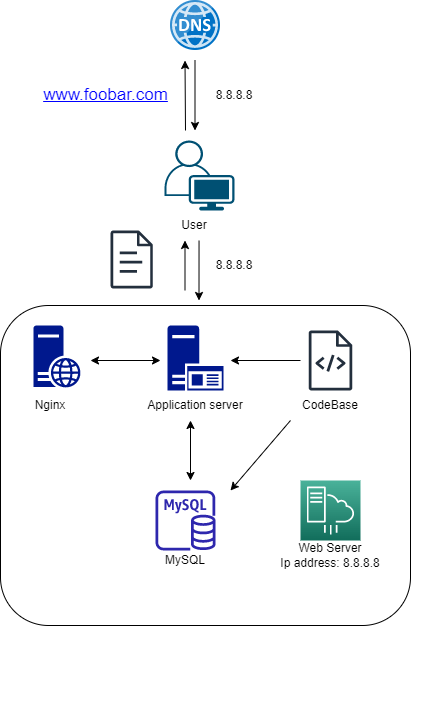

# Simple Web Stack

## Description
This is a basic web infrastructure that operates as a hosting platform for a website accessible via www.foobar.com. There are no security measures such as firewalls or SSL certificates implemented to safeguard the server's network. All components, including the database and application server, are required to utilize the server's shared resources, including CPU, RAM, and SSD storage.

##Specifics About This Infrastructure
+ What is a Server?
  A server is a computing system, comprising either hardware or software, that offers various services to other computers known as clients.
+ The domain name plays a crucial role in providing a user-friendly alias for an IP address. For instance, instead of remembering and typing a complex IP
  address like 91.198.174.192, users can simply use a domain name like www.google.com .
  The mapping between the IP address and its corresponding domain name alias is maintained in the Domain Name System (DNS).
+ The type of DNS record www is in www.foobar.com.
  www.foobar.com uses an A record. This can be checked by running dig www.foobar.com.
  Note: the results might be different but for the infrastructure in this design, an A record is used.
  Address Mapping record (A Record)—also known as a DNS host record, stores a hostname and its corresponding IPv4 address.
+ The role of the web server.
The web server is a software/hardware that accepts requests via HTTP or secure HTTP (HTTPS) and responds with the content of the requested resource or an error messsage.
+ The role of the application server.
To install, operate and host applications and associated services for end users, IT services and organizations and facilitates the hosting and delivery of high-end consumer or business applications
+ The role of the database.
To maintain a collection of organized information that can easily be accessed, managed and updated
+ What the server uses to communicate with the client (computer of the user requesting the website).
Communication between the client and the server occurs over the internet network through the TCP/IP protocol suite.

##Issues With This Infrastructure
+ There are multiple SPOF (Single Point Of Failure) in this infrastructure.
For example, if the MySQL database server is down, the entire site would be down.
+ Downtime when maintenance needed.
When we need to run some maintenance checks on any component, they have to be put down or the server has to be turned off. Since there's only one server, the website would be experiencing a downtime.
+ Cannot scale if there's too much incoming traffic.
It would be hard to scale this infrastructure becauses one server contains the required components. The server can quickly run out of resources or slow down when it starts receiving a lot of requests.
